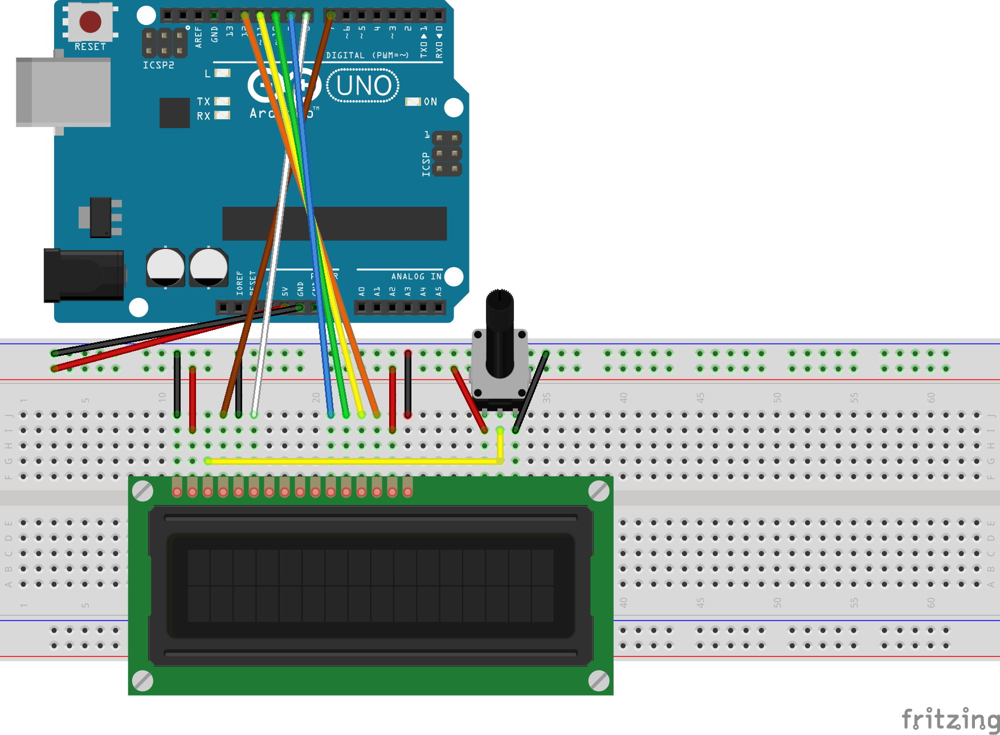

# Intermediate Arduino

Reference point for Sublime Errors, Analog Control, LCD Communication, Interrupt Commands, and Operating a Photointerruptor
Also the temporary home for GitHub help

## Table_of_Contents 
*([ToC](#table_of_contents) for short)*

### [LED_Blink_Revisited](#led_blink_revisited-1)
- [Assignment](#assignment)
- [Code](#code)
- [Wiring](#wiring)
- [Problems](#problems)

### [Hello_LCD](#hello_lcd)
- [Assignment](#assignment-1)
- [Code](#code-1)
- [Wiring](#wiring-1)
- [Problems](#problems-1)

### [LCD_Backpack](#lcd_backpack-1)
- [Assignment](#assignment-2)
- [Code](#code-2)
- [Wiring](#wiring-2)
- [Problems](#problems-2)

### [Photointerrupters](#photointerrupters-1)
- [Assignment](#assignment-3)
- [Code](#code-3)
- [Wiring](#wiring-3)
- [Problems](#problems-3)

### [Potentiometers](#potentiometers-1)
- [Assignment](#assignment-4)
- [Code](#code-4)
- [Wiring](#wiring-4)
- [Problems](#problems-4)

### [Motor_Control](#motor_control-1)
### COMING SOON!
- [Assignment](#assignment-5)
- [Code](#code-5)
- [Wiring](#wiring-5)
- [Problems](#problems-5)
----------

### LED_Blink_Revisited
##### Aug 23
Back to [ToC](#table_of_contents)
- [Assignment](#assignment)
- [Code](#code)
- [Wiring](#wiring)
- [Problems](#problems)
#### Assignment

This assignment is deceptively easy -- just make an LED turn on and off. The problem comes with using a new text editor -- Sublime. It's toolchain is very fickle, and will just not work sometimes. Either way I got it done in a timely manner.

#### Code
*Commented Code link [Here:](led_fade)* \
[Triangle Wave](led_fade/led_fade_triwave)

[Sinusoidal Wave](led_fade/led_fade_signwave)

Now, I don't feel the need to explain how to blink an led.

What I SHOULD explain is the spicy alterations of this assignment
>Slightly spicy part: Chances are, your code uses digitalWrite() to turn turn LED's voltage on and off. Instead, use analogWrite() to make the LED fade in and out, rather than blink.  You're gonna want some variable that slowly goes from 0 (off) to 255 (on) and back.

>More spicy part: as the LED is fading in and out, write a line of characters (x's or dashes or something) to the serial monitor (remember your friends Serial.print() and Serial.println()?), indicating the LED brightness.  In other words, when the LED is at zero brightness, you are writing "-" but when the LED is at full brightness, you are writing "--------------------" or something like that.  The result should be a wave of text growing and shrinking with your LED brightness.

Since I'm just so good, I did all of the above, including...
>If you feel like going for the full spice (!), have the brightness fade in and out sinusoidally, rather than linearly.

*Note: triwave corresponds to the first one, signwave corresponds to the above*

#### Wiring

You literally just put a wire from a digital port with a ~ to an LED, then to ground.
Don't forget a 220 resistor, and that the short end is ground

#### Problems

None of great significance, besides the ~ port thing

Trying to comment it after the fact was hard tho; if you get math, you should have a easy time. Good luck otherwise ;)

### Hello_LCD
##### Aug 28
Back to [ToC](#table_of_contents) 

- [Assignment](#assignment-1)
- [Code](#code-1)
- [Wiring](#wiring-1)
- [Problems](#problems-1)

#### Assignment
This assignment was all about getting an LCD hooked up and printing things to the screen. Thankfully, soldering pins is no longer required, since it's all done for us already
>  Here is the assignment.  On line 1 of the LCD, print "Hello World."  On line 2 of the LCD, print the number of seconds that have transpired since the program began. 

Since we have a nice teacher, he told us:

> [We're] going to need the following lines somewhere: 
```arduino
#include <LiquidCrystal.h>
LiquidCrystal lcd(7, 8, 9, 10, 11, 12); // Those are the pins for RS, EN, DB4, DB5, DB6, DB7, respectively
lcd.begin(16, 2);
lcd.setCursor(0,0);
lcd.print("stuff");
```
#### Code
Link to code [here.](hello_lcd/hello_lcd.ino)

#### Wiring


[*Link to Fritzing*](hello_lcd/hello_lcd.fzz)

Alternatively, [here's](https://learn.adafruit.com/character-lcds/wiring-a-character-lcd) a link to the adafruit article in the assingment description. They're describing the same schematic.

#### Problems

None of much substance. That article can be very confusing about how to wire up everything properly; You don't need to know why you're doing what you're doing, just use the fritzing.

### LCD_Backpack
#### Sep 4
Back to [ToC](#table_of_contents)
- [Assignment](#assignment-2)
- [Code](#code-2)
- [Wiring](#wiring-2)
- [Problems](#problems-2)
#### Assignment
>Now, since you're communicating over I2C, you'll need a new library.  In Sublime, select Arduino -> Install Library -> Display -> L -> LiquidCrystal I2C -> [the most recent one].  That should do it.  At the top of your code, you'll need:
```arduino
	#include <Wire.h>
	#include <LiquidCrystal_I2C.h> 
	LiquidCrystal_I2C lcd(0x27,16,2);  /* set the LCD address to 0x27
	for a 16 chars and 2 line display. */ 
	// If 0x27 doesn't work, try 0x3F.
```
> In setup(), you'll need:
```arduino
	lcd.init()
	lcd.backlight();
```
> The rest should be the same, using lcd.print() and lcd.setCursor(). 

> ...

> Time to spice it up.  Add a button to your breadboard (see figure to the right for a button refresher).  The LCD screen should display a count of how many times the button has been pressed.  Maybe a message like "Button presses: 34"

>Even spicier: add a breadboard SPDT switch (wiring is basically the same as the push button).  If the switch is in one position, pushing the button counts up.  If it's in the other position, pushing the button counts down.

>Show me when you're done.

#### Code
Link to code [here.](lcd_backpack/lcd_backpack.ino)

#### Wiring
>Grab an LCD backpack and four female-female jumper wires.  Wire it up:GND to GND, VCC to 5V, SDA to A4, and SCL to A5.  Then stick its 16 pins into the LCD's 16 female pins.  That's it! 

*Fritzing coming soon* 

#### Problems
If I remember correctly, my main problem was that I couldn't choose a way to do it or I was trying to find the most efficient way to do it. Also, something was really glitchy with my code (where it was working, but then I came back to it after a bit and it stopped working). Also, I had this issue where the LCD would only print the first character of a string (e.g. ```lcd.print("TEST");``` would only print ```T```); the only way to print a word was to do it one character at a time. For example: \
Both this:
```arduino 
lcd.print("T");
lcd.print("E");
lcd.print("S");
lcd.print("T");
```
and this:
```arduino 
lcd.print("TEST");
lcd.print("Epls work");
lcd.print("Save me");
lcd.print("THelp");
```
Would both print:```TEST```to the LCD. The way I fixed it was just to delete and reinstall the ```LiquidCrystal_I2C``` library.
*Note: I got this problem when I had already moved on to Potentiometers, but it had to only do with the LCD, so I put it up here.*
### Photointerrupters
#### Sep 13
Back to [ToC](#table_of_contents)

- [Assignment](#assignment-3)
- [Code](#code-3)
- [Wiring](#wiring-3)
- [Problems](#problems-3)

#### Assignment
> Wire up a circuit that will turn on an LED when something is in between the legs of photo interrupter. Once you have that circuit up and running, it's time to spice it up (sorry, this seems to be a theme).

> Enter the attachInterrupt() function!

> For a full description, go here: https://www.arduino.cc/en/Reference/AttachInterrupt (Links to an external site.), but here are the basics.  The attachInterrupt(pin, function, mode) function takes three arguments

	> pin - which pin you want to listen to (0 listens to digital pin 2 and 1 listens to digital pin 3; not intuitive, I know)

	> function - which function you want to fire off when the interrupt occurs

	> mode - what kind of change you want to listen for (for example, RISING to trigger when the pin goes from low to high or FALLING for when the pin goes from high to low)

>You can use attachInterrupt() anywhere, but let's specify two in the setup() function.  One will turn the LED on with RISING.  The other will turn the LED off with FALLING.  So your code won't use any digitalRead() fucntions, only interrupts.

> One more thing: use Serial.println() to print out how many times the photo interrupter has been interrupted.

#### Code
Link to code [here.](photointerruptor/photointerruptor.ino)
#### Wiring
#### Problems
I had a bunch of problems trying to get the photointerruptor to work, so I kept trying to unplug and plug it back in, replacing it, etc. It turned out that the problem was actually with my code! Don't try and do any sort of equality in an interrupt; just make a function that doesn't return anything and does the equality in said function (Like my code does!). Also, apparently only two pins can do interrupts, and can only watch one action (you can't have pin 2 look for both ```RISING``` and ```FALLING```).
### Potentiometers
#### Sep 18
Back to [ToC](#table_of_contents)
- [Assignment](#assignment-3)
- [Code](#code-3)
- [Wiring](#wiring-3)
- [Problems](#problems-3)
#### Assignment
#### Code
#### Wiring
#### Problems
None really, besides that weird LCD thing. The max value of the potentiometer is 1024 (or whatever I had it as in my code).
### Motor_Control
#### Sep 25
Back to [ToC](#table_of_contents)
- [Assignment](#assignment-5)
- [Code](#code-5)
- [Wiring](#wiring-5)
- [Problems](#problems-5)
Coming Soon!!
#### Assignment
#### Code
#### Wiring
#### Problems
